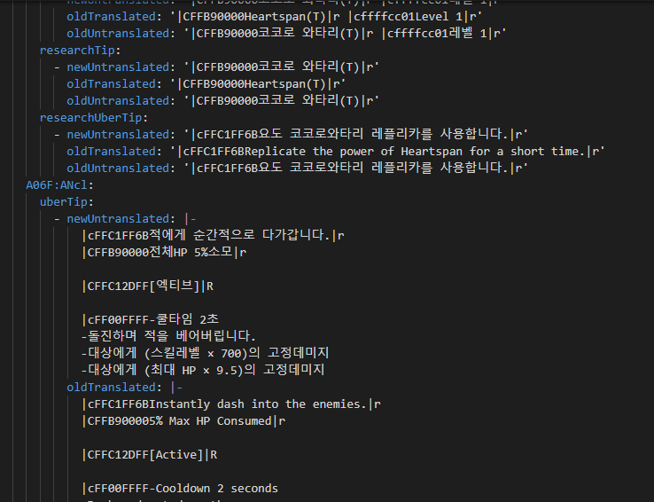
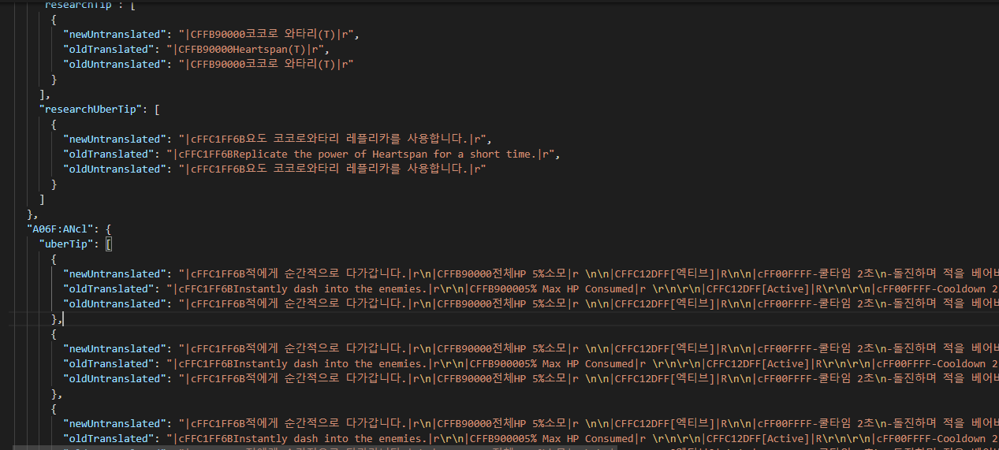

# wc3-translate
Node translation tool for warcraft 3 maps

# Motivation
I have been translating eden rpg map since 2017 [with wcstrings](https://github.com/juvian/warcraft-3-translating). It is a great tool, but author disappeared and the website it was hosted on died. There were a few details that always bothered me about wcstrings:
1. No easy way to track things you needed to translate with a new version (there is a changes output but it was not always relevant for the strings to translate, and there was no option for strings in script/wts files). I solved this with a python script so didn't bother me too much.
2. No easy way to ignore certain lines, which I know are names of players that bought something in the game. Made a python script for this so it didn't bother me as much.
3. It is a really old program with a really old stormlib version, certain maps can't even be read by it and there is no way to just give it the files. Need to extract files, make a new mpq with mpqmaster, add files and translate that one instead. This never happened to me but know people that need to go this route.
4. If you messed up a file, it won't show any error and will just ignore all the translation for it. Kind of fixable by installing a lua sintax checker and making sure the sintax is good after finishing each file.
5. Bothersome to reapply translations. Most of the times, an item or ability tooltip change a single character, line or number. But in wcstrings we will just see all in korean, having to go to older files, check if korean source was similar to current one to notice what changed and then if it was just a few details, go to the translated file, reuse translation and then apply the change. This point really bothered me, especially when I had 100+ ability tooltips changing because of a single number change in them.

After many years of living with this issues finally decided to make my own tool. Some features may be specific to the map I translate but most should be aplicable to any map.

# Installation
1. Install [node](https://nodejs.org/en/download/)
2. Either clone the repo with git (very recommended), download as zip and extraxt (recommended), or run npm install juvian/wc3-translate.
3. Go to main directory and run npm install

# toJson
`node toJson.js map1 map2 map3 output.yaml `
For lack of better name, this is the command that takes the new untranslated map you want to translate and optionally, the old translated + untranslated versions and outputs all the relevant strings into a file. If the file output format will be yaml or json according to the extension used in command (yaml recommended).

There is also a plugins system, which would allow you to extend the functionality with your own plugins. Check the plugins folder for some examples:

1. setChanged: this plugin checks if the old korean map string is different than the new one and if it is, will add a changed property and the newTranslated property for you to write. This is useful so you can search for this in the output to know what you need to translate.
2. setKorean: this plugin uses regex to check if your old translation still has korean chars. This is useful to check if something is still left untranslated, although it is not new
3. guessTranslations: this plugin checks if the only thing that changed between old and new korean are just numbers/tooltip colors. In that case, it will try to attempt an auto translation based on the old translation and the new changes. The newTranslated property will be filled and an additional numberGuessed property will appear for you to know that string was translated this way (might need to validate its right).
4. setOnlySpacingDiff: this plugin checks if the only thing that changed between old and new korean are just spaces, in which case it adds a onlySpacingDiff property to those (useful to know at a quick glance that nothing changed other than spacing)
5. ignorePlayers: plugin specific to eden but could be useful to make a similar for your own map. It loads the map code and searches for some patterns to ignore and removes those from the output (I don't need to translate player names that bought something).
6. ignoreStrings: similar but with specific strings I don't want to translate

Example: `node toJson.js path/to/newMap/map.mpq path/to/oldMap/eng_map.mpq path/to/oldMap/map.mpq path/to/output/translations.yaml plugins/setChanged.js plugins/guessTranslations.js`

Note that some plugins depend on others (guessTranslations and setOnlySpacingDiff rely on the changed property being set, which is done by setChanged). Thus the setChanged plugin should be set before those if you are planning to use them, as the order of plugin execution is the order you give it.

The paths to maps do not need to be mpqs, it is possible that my tool won't be able to read certain maps. In that case, you should use [MPQ Editor](http://www.zezula.net/en/mpq/download.html) to extract the relevant files into a folder and you can use this folder as parameter instead of the map itself. Relevant files are:

1. war3map.w3u: units file
2. war3map.wts: strings file
3. war3map.w3a: abilities file
4. war3map.w3t: items file
5. war3map.w3h: buffs file
6. war3map.w3q: upgrades file
7. war3map.w3b destructables file
8. war3map.w3d doodads file
9. war3map.w3i map info
10. war3map.j map script

## Output format

Most files follow the same format, except for script, strings and map info. Strings from wts file are just replaced where they were referenced (unit will say Crusader instead of TRIGSTR_12784) and then not repeated on the strings part of output file. This means the remaining things in strings in theory are not used anywhere (if you processed all map files) so there is no need to translate those. It is hard to match strings used in script with their corresponding translation, an algorithm is used to estimate this. It is possible you will have to retranslate things you already had, but this should happen rarely. Let me know if it does

# toWar
`node toWar.js output.yaml outputFolder`

This is the command that picks what you translated from the output file, does the necessary replacements with the old values and outputs the files to the specified folder (if outputFolder is not specified, the same folder as the map is used). You should then use MPQ Editor to place those files in your map

Given a string, it will replace with whichever was defined in the following order:

1. newTranslated property
2. oldTranslated property
3. keep the same

This means if something changed in the original language but you think the translation should remain the same, there is no need to fill out newTranslated, just let it reuse oldTranslated. This also means that instead of adding newTranslated, you could just edit this (it may have some consecuence with plugins if you later use update.js though).

Example: `node toWar.js path/to/output/translations.yaml path/to/output/files`

# update
`node update.js output.yaml plugin1 plugin2`

There may be situations where you either forgot to apply some plugin or want to rerun some, without having to use toJson again which would overwrite what you already translated. Update does exatly this, given the output file and the plugins you want to run, it will edit the file 

Example: `node update.js path/to/output/translations.yaml plugins/ignoreStrings.js plugins/ignorePlayers.js`

# Misc
If you have any doubts feel free to ask in [Wc3 Translators United](https://discord.gg/QEPuPFB8jY) discord server.

